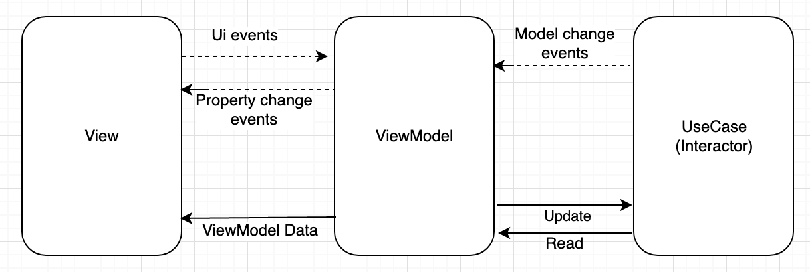
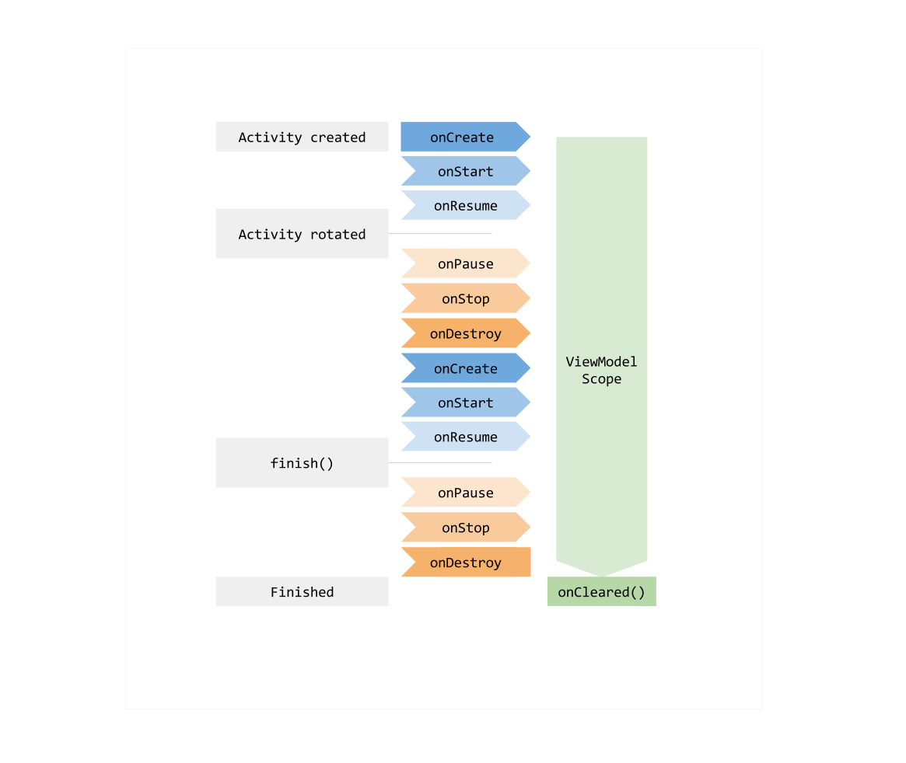

# Sample app from Dicoding MADE with MVVM + Clean Architecture and Modularization 

This project is using Kotlin, MVVM Pattern and the latest components from Jetpack library.

Also this project is using the Uncle Bob's clean architecture approach.
  - [Architecting Android..the clean way](https://fernandocejas.com/2014/09/03/architecting-android-the-clean-way/)
  - [Architecting ANdroid..the evolution](http://fernandocejas.com/2015/07/18/architecting-android-the-evolution/)
  - [Clean Architecture..Dynamic parameters in UseCase](http://fernandocejas.com/2016/12/24/clean-architecture-dynamic-parameters-in-use-cases/)

# Getting started
This project uses the Gradle build system. To build this project, use the
`gradlew build` command or use "Import Project" in Android Studio.

There are two Gradle tasks for testing the project:
* `connectedAndroidTest` - for running Espresso on a connected device
* `test` - for running unit tests

Before create a PR, developer need to follow the action below:
* Execute `gradlew detekt`
* If execution is failed , developer need to fix the code smells based on the report from detekt analyzed
* The report of the result from detekt analyzed will be generated in /app/build/reports/detekt/
* If the code doesn't smelly anymore, developer can create the PR.

 
For more resources on learning Android development, visit the [Developer Guides](https://developer.android.com/guide/) at [developer.android.com](https://developer.android.com).

# Introduction of Jetpack Library
Android Jetpack is a set of components, tools and guidance to make great Android apps. They bring together the existing Support Library and Architecture Components and arranges them into four categories:

  

# Introduction of Detekt
Meet _detekt_, a static code analysis tool for the _Kotlin_ programming language. It operates on the abstract syntax tree provided by the Kotlin compiler.

### Features

- Code smell analysis for your Kotlin projects
- Complexity report based on logical lines of code, McCabe complexity and amount of code smells
- Highly configurable
- Suppress findings with Kotlin's `@Suppress` and Java's `@SuppressWarnings` annotations
- Specify code smell thresholds to break your build
- Code Smell baseline and ignore lists for legacy projects
- [Gradle plugin](#with-gradle) for code analysis via Gradle builds
- Gradle tasks to use local `IntelliJ` distribution for [formatting and inspecting](#idea) Kotlin code
- [SonarQube integration](https://github.com/arturbosch/sonar-kotlin)
- Extensible by own rule sets, `FileProcessListener's` and `OutputReport's`
- [IntelliJ integration](https://github.com/arturbosch/detekt-intellij-plugin)
- Unofficial [Maven plugin](https://github.com/Ozsie/detekt-maven-plugin) by [Ozsie](https://github.com/Ozsie)

### Project Website

Visit https://arturbosch.github.io/detekt/ for installation guides, release notes, migration guides, rule descriptions and configuration options.

##### Quick-Links

- Changelog and migration guides: https://arturbosch.github.io/detekt/changelog.html
- Available CLI options: https://arturbosch.github.io/detekt/cli.html
- Rule set and rule descriptions: https://arturbosch.github.io/detekt/complexity.html
- Writing custom rules and extending detekt: https://arturbosch.github.io/detekt/extensions.html
- Suppressing findings? https://arturbosch.github.io/detekt/suppressing-rules.html https://arturbosch.github.io/detekt/baseline.html
- Configuring detekt? https://arturbosch.github.io/detekt/configurations.html
- Sample gradle integrations examples
    - multi project (kotlin dsl): https://github.com/arturbosch/detekt/blob/master/build.gradle.kts
    - single project (groovy dsl): https://github.com/arturbosch/kutils/blob/master/build.gradle
    - single project (unofficial maven plugin): https://github.com/arturbosch/sonar-kotlin/blob/master/pom.xml
    - setup additional detekt task for all modules (kotlin dsl): https://github.com/arturbosch/detekt/blob/3357abba87e1550c65b6610012bb291e0fbb64ce/build.gradle.kts#L280-L295
    - setup additional formatting task for all modules (kotlin dsl): https://github.com/arturbosch/detekt/blob/3357abba87e1550c65b6610012bb291e0fbb64ce/build.gradle.kts#L262-L278

# Introduction Clean Architecture
The idea is simple: clean architecture stands for a group of practices that produce systems that are:
* Independent of Frameworks.
* Testable.
* Independent of UI.
* Independent of Database.
* Independent of any external agency.

It is not a must to use only 4 circles (as you can see in the picture), because they are only schematic but we should take into consideration the Dependency Rule: source code dependencies can only point inwards and nothing in an inner circle can know anything at all about something in an outer circle.

Here is some vocabulary that is relevant for getting familiar and understanding this approach in a better way:

* Entities: These are the business objects of the application.
* Use Cases: These use cases orchestrate the flow of data to and from the entities. Are also called Interactors.
* Interface Adapters: This set of adapters convert data from the format most convenient for the use cases and entities. Presenters and Controllers belong here.
* Frameworks and Drivers: This is where all the details go: UI, tools, frameworks, etc.

### Architectural Approach

### Architectural Reactive Approach

# Introduction of MVVM
We use MVVM architecture pattern and also use ViewModel from Jetpack library.

ViewModel is one of the newly introduced architecture components. Architecture components provide a new class called ViewModel, which is responsible for preparing the data for the UI/View.

